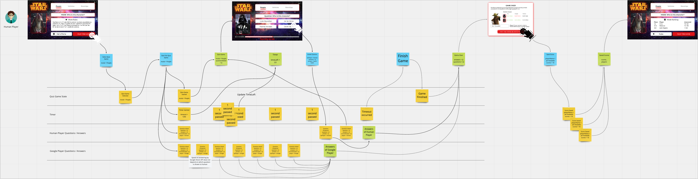

# CodersCamp 2020 - Projekt JavaScript
**CodersCamp (coderscamp.edu.pl) - Największy otwarty kurs programowania webowego** 

Wykorzystanie asynchronicznego JavaScript oraz korzystanie z REST API.


Proponowany projekt — Quiz Star Wars (opis poniżej).

### Zasady wykonywania projektu (wspólne dla wszystkich grup i mentorów): 

##### W projekcie każdy z uczestników powinien zaprezentować praktyczną znajomość poniższych zagadnień związanych z JavaScript:
- zmienne
- operatory porównania
- pętle
- obiekty, atrybuty
- warunki
- funkcje
- operatory logiczne
- tablice
- iteracja i/lub rekurencja
- console
- return
- "===" vs "=="
- integracja z zewnętrznym REST API
- interakcja z domem
- odwoływanie się do elementów DOM z JavaScript
- zmiana stylów z poziomu JSa
- zmiana zawartości HTML z poziomu JSa
- animacje
- zewnętrzne biblioteki
- async await i/lub Promise
- funkcje callback
- metody HTTP
- pisanie testów jednostkowych 

Do implementacji nie używajcie React, czy takich frameworków jak Angular.
Najlepiej odstawcie też na bok biblioteki stylów takie jak Bootstrap — na upraszczanie życia przyjdzie jeszcze czas.
Ważne, żeby opanować, to co, jest pod spodem gotowych już bibliotek.
Skupcie się na wykorzystaniu w praktyce tego, co nauczyliście się dzięki materiałom w przerabianym dziale.
 

##### W trakcie trwania projektu należy wyznaczyć w zespole odpowiednie funkcje
Aby zespół pracował efektywnie, ważne jest, żeby było wiadomo, kto odpowiada, za jaką kwestię.
Powstało wiele różnych metod wspomagające działanie zespołu, które stosuje się także przy pracy programisty.
W trakcie trwania kursu CodersCamp spróbujemy przemycić Wam o nich jak najwięcej w praktyce.
Niestety forma kursu znacznie ogranicza możliwości — zazwyczaj programiści na swoją pracę i jej organizację poświęcają cały etat. 
Tutaj nie mamy tyle czasu na pełne zastosowanie np. Scruma, czy też innych technik. 
Mamy jednak nadzieję, że po kursie nie będą one dla Was już wielką niewiadomą.

Pierwszym krokiem do lepszej organizacji Waszego zespołu będzie wyznaczenie w nich kilku funkcji, które są typowe dla projektów IT.
Z pewnością spotkanie się z nimi w praktyce zawodowej.
Najlepiej, gdyby uczestnicy po prostu się zgłosili. 
W przypadku braku chętnych mentor wyznacza „ochotników".
Oczywiście każda z ról wykonuje prace programistyczne (w przypadku CodersCamp, w rzeczywistości jest to różnie), dodatkowo zajmując się wspomnianymi dla danej roli obowiązkami.
Role należy zmieniać następnie co projekt, aby każdy miał szansę się sprawdzić w którejś z nich.
Szczególnie w pierwszym projekcie poproście mentora o pomoc w spełnianiu swoich ról i podzieleniu się zadaniami.
Wasz mentor może oczywiście pokierować pracą trochę inaczej i zaproponować inny podział lub dodać też jakąś funkcję w zespole.
Warto zorganizować spotkanie rozpoczynające prace, na którym wykonacie i/lub omówicie podstawowy setup projektu.

###### Klient
Zawsze jest to **Mentor**. Uważajcie! 
Ten klient ma też zdolności techniczne i lepiej z nim nie dyskutować, jeśli coś „zaproponuje”.
Dodatkowe testy czy zmiana sposobu implementacji to uwagi jak najbardziej na miejscu. 
Pamiętajcie też, że jedyną stałą w projektach informatycznych jest zmiana.
Wszelkie zmiany w projekcie, jakie zaproponuje Klient, powinny jak najbardziej zostać wzięte pod uwagę :) 
W sytuacjach krytycznych można też poprosić go o posłużenie radą. Będzie też przeglądał każdy wasz wykonany kod.

###### Tech Lead
Ma ostateczne zdanie w kwestiach związanych z technologią, ale dobrze, jeśli radzi się zespołu.
Np. jak dzielimy moduły projektu, w jaki sposób testujemy, której biblioteki użyć.
Powinien też respektować zdanie klienta.
Jeśli Tech Lead będzie przeprowadzał Code Review zadań, jest to jak najbardziej na plus. 
Chociaż zachęcamy do tego wszystkich członków zespołu.

###### Product Owner
Odpowiada za wizję produktu i kwestie związane z funkcjonalnościami. 
Powinien podejmować ostateczne decyzje odnośnie do wątpliwości związanych z wymaganiami i wyjaśniać je z klientem.
Bardzo pożądane jest, aby często konsultował się z klientem i starał się, aby reszta zespołu mogła się skupić na swoich zadaniach zamiast doprecyzowywaniu wymagań.

###### Development Manager
Oczywiście Klientowi zależy najbardziej na tym, aby projekt zakończył się na czas. 
Dlatego zespół będzie nieustannie przez niego kontrolowany.
Jednakże, w trakcie pracy ważne jest, aby uzyskać zaufanie klienta i te kontrole nie były w ogóle potrzebne.
Development Manager będzie dbał odpowiednio o terminy, podział zadań, a także wywiązywanie się z obowiązków innych członków zespołu.
Powinien też kontrolować jakoś pracy — np. poprzez pilnowanie regularnych Code Review lub organizowanie programowania w parach (jeśli Wasz mentor jest za takimi praktykami).
Jeśli spełni odpowiednio swoją funkcję, to duża szansa, że uda wam się uformować efektywny i zgrany zespół, a klienci nie będą wypatrywali tylko na wasze potknięcia :)
W gestii Development Managera leży też organizowanie codziennych daily. Najlepiej, aby przyjęły formę wiadomości na Discord. 
W ciągu dnia każda osoba z zespołu powinna odpowiedzieć na 3 pytania:
- Co zrobiła od ostatniego daily?
- Co planuje zrobić do kolejnego daily?
- Czy są jakieś problemy przy wykonywaniu zadań?
Oczywiście poprawną odpowiedzią w przypadku CodersCamp jest też: 
```
1. Od ostatniego daily zaimplementował zadanie. Wystawiłem Pull Request (TUTAJ), proszę Was o code review.
2. Do kolejnego nic nie zrobię - całą środę pracuję. Zamierzam posiedzieć nad projektem dopiero od czwartku. 
3. Mam problem z połączeniem z SWApi, czy ktoś mógłby zerknąć, błąd opisałem w issue na GitHub.
```
Mogą być takie dni, że nie uda nam się zrobić nic albo po prostu nie planowaliście poświęcać czasu na CodersCamp, czy byliście cały dzień w pracy. 
Najważniejsza jest komunikacja, aby wiedzieć, jaki jest status projektu.
Warto też organizować co tydzień zdzwonki, aby nie tylko pisać, ale też porozmawiać jak idzie projekt i ewentualnie poprosić mentora o pomoc / wyjaśnienia itp. 
Pamiętajcie, że mentor jest ciągle do waszej dyspozycji, więc nie musicie specjalnie czekać, żeby się z nim skomunikować.


##### Sposób oceny projektu (i wszystkich kolejnych projektów na CodersCamp)
Zapewne interesuje Was, w jaki sposób projekt zostanie „zaliczony” i oceniony.
Ocenianie będzie miało kilka etapów.
- Spotkanie OnLine na Google Meets: 
    - Podczas spotkania zbierają się 2 lub 3 wcześniej wylosowane grupy z CodersCamp. 
    Wzajemnie prezentujecie wykonane przez Was projekty.
    Czas prezentacji jednego zespołu to maksymalnie 10 minut + 5 minut na pytania od innych zespołów.
    Forma prezentacji pozostaje dowolna.
    Możecie przygotować jakieś slajdy, ale niekoniecznie. 
    Filmiki, odegrane scenki, czy wszytko co Wam przyjdzie na myśl, jest dozwolone. 
    Celem prezentacji jest „sprzedanie” (pokazanie, że to, co zrobiliście, spełnia założenia) Waszej aplikacji osobom obecnym na spotkaniu.
    Na pewno musi zostać pokazana działająca aplikacja, reszta wg uznania.
    Wszelkie zmiany czy brak funkcjonalności w projekcie należy po prostu dobrze zaprezentować. 
- Ocena zaangażowania przez Waszego mentora:
    - Mentor określa procentowo jakie było wasze zaangażowanie w projekt (każdy z uczestników otrzymuje od 0 do 100%). 
    Składa się na to między innymi: terminowość, spełnianie ról. Szczegóły mentorzy dostaną w osobnym dokumencie. 
    Można dostać też dodatkowe 10% (w sumie max zaangażowania to 110%) za pełnienie wcześniej opisanej roli w zespole.
    Jest to wg uznania mentora.
- Ocena wykonanego projektu przez 2 mentorów (wasz mentor i jeden z obecnych na prezentacji — tzw. mentor recenzent):
    - Jako zespół otrzymacie liczbę punktów od obu mentorów. Następnie zostanie z niej wyciągnięta średnia i pomnożona przez procent zaangażowania w projekt.
      Pamiętajcie, że ocena nie jest najważniejsza — im więcej pracy wykonacie, tym więcej praktycznych umiejętności opanujecie. 
      Zachęcamy mentorów do uzasadniania przydzielonych punktów, tak abyście mogli wyciągnąć z nich jak najwięcej na przyszłość.
      Mentorzy mają różne doświadczenie zawodowe i będą z pewnością właśnie oceniać przez jego pryzmat. 
      Dzięki zmianom mentorów recenzentów zobaczycie z pewnością różne spojrzenia na podobne kwestie.
      
Przykładowy arkusz w jakim mentorzy będą oceniać wasze projekty znajdziecie TUTAJ. //TODO: ARKUSZ
      
##### Zgłoszenie projektu, jako gotowego do oceny
Do końca dnia poprzedzającego prezentację Development Manager zespołu musi zgłosić zakończenie prac poprzez wysłanie odpowiedniego formularza.


## Quiz Gwiezdne Wojny
Teraz przechodzimy do przykładowego projektu, który został przygotowany przez organizatorów kursu.
Proponowany projekt pozwala na zastosowania większości umiejętności, jakie powinniście posiąść w trakcie przerabiania działu.
Jednakże jeśli macie pomysł na projekt podobnej skali, który spełni opisane na górze wymagania i czujecie się na siłach
w zdefiniowaniu funkcjonalności, przygotowaniu ekranów i podzieleniu go na zadania — to nic nie stoi na przeszkodzie,
aby wykonać np. coś związanego z zainteresowaniami Waszej grupy :) Powodzenia!
 
Czas porzucić narrację CodersCamp i wcielić się w członka zespołu projektowego...

### Założenia projektowe
Jedna ze znanych marek płatków śniadaniowych prowadzi wieloletnią współpracę z wytwórnią filmów Disney, do której od niedawna należą także Gwiezdne Wojny.
W ramach kolejnej akcji promocyjnej wasz zespół został poproszony o przygotowanie Proof of Concept aplikacji związanej ze Star Wars.
Po wstępnym rozpoznaniu i analizie biznesowej podjęto decyzję o przygotowaniu quizu sprawdzającego znajomość uniwersum Gwiezdnych Wojen.
Ma to być aplikacja webowa działająca w przeglądarce, bez potrzeby instalacji.

Klient dostarczył prototyp interfejsu użytkownika dostosowany pod Desktop ([TUTAJ](https://www.figma.com/proto/4HOOjnEYjb7W7xEh2Vb4lx/CodersCamp2020.Project.JavaScript.StarWarsQuiz?node-id=256%3A127&scaling=min-zoom)).
Pokazany został tylko jeden tryb i jedno pytanie. Cała reszta działa analogicznie.
Projekt: https://www.figma.com/file/4HOOjnEYjb7W7xEh2Vb4lx/CodersCamp2020.Project.JavaScript.StarWarsQuiz?node-id=256%3A107
Może się przydać do odczytania np. cieni i kolorów. Nie zwracajcie uwagi na jednostki w px, należy użyć jednostek responsywnych.


Dostarczona została także lista funkcjonalności. 
1. Wybór trybu quizu (People, Vehicles, Spaceships)
2. Opis zasad dla quizu. Obok zasad pokazuje się losowe zdjęcie z danego trybu (dostosowany opis, jeśli np. imię osoby ze zdjęcia jest w opisie zasad).
3. Po rozpoczęciu gry rozpoczyna się odliczanie czasu (2 minuty).
4. Zadaniem gracza jest odpowiedzieć na jak najwięcej pytań w ciągu ustalonego czasu (dodatkowo gracz konkuruje także z komputerem! Komputer tak samo jak gracz próbuje rozpoznać co jest na grafice). 
5. W trakcie trwania quizu miecz świetlny pokazuje, ile jeszcze czasu zostało. Po wybraniu odpowiedzi zostaje ukazane przez sekundę czy odpowiedź była dobra czy zła. Następnie pytanie zostaje zmienione na kolejne (prototyp pokazuje jedynie 1 pytanie) i tak do końca czasu.
5. Pytania są generowane w następujący sposób: 
    - zostaje pobrany losowy zasób z danego trybu (np people o id 5)
    - zostanie pobrane dla wylosowanego zasobu zdjęcie
    - losowane są 3 odpowiedzi z zapytania do StarWars API. Dla trybu "People" będzie to: https://swapi.co/api/people (jedna brana jest z wcześniej wylosowanego, musi być poprawna)
6. Po ukończeniu czasu wynik gracza zapisywany jest w rankingu dla danej przeglądarki (LocalStorage) i pokazywany jest ranking 3 najlepszych wyników.

Jedno z wcześniejszych wykonań działającej aplikacji możecie zobaczyć [TUTAJ](https://nowakprojects.github.io/CodersCamp2020.Project.JavaScript.StarWarsQuiz/index.html). 
Jednakże nie należy się na nim 100% wzorować.
Niektóre wymagania mogły ulec zmianie, a przedstawiana aplikacja nie jest responsywna.
**Jeśli macie w swoim zespole osobę chętną na przygotowanie designów, to także możecie UI zrobić kompletnie inaczej.**

Waszym zadaniem będzie zaimplementować aplikację, aby działała wg wymagań klienta, a także przygotować i wykonać
wersję responsywną aplikacji (dostosowaną do wyświetlania na Tabletach i Telefonach — możecie przygotować najpierw projekt interfejsu, lub od razu przejść do implementacji).
W celu zaprezentowania działania aplikacja musi być możliwa do odwiedzenia w internecie.
Klient nie chce ponosić za to żadnych dodatkowych kosztów, dlatego należy wykorzystać jedną z usług oferujących darmowe
uruchomienie takiej aplikacji (np. GitHub Pages).
Klient wymaga także, aby aplikacja nie tylko działała, ale była odpowiednio pokryta testami.
Naprawdę macie szczęście co do klienta! Wielu uważa testy za niepotrzebne i jedynie stratę pieniędzy.
A co znaczy „odpowiednio pokryta” to już należy właśnie ustalić z samym Klientem :) 
Wszelkie nieścisłości w wymaganiach powinien wyjaśniać Product Owner wraz z Klientem.

### EventModeling
Działanie aplikacji zostało także zamodelowane za pomocą techniki EventModeling.
Jeżeli chcecie, to możecie skorzystać z poniższego diagramu. Zapoznać się z tą techniką możecie na [blogu autora tej metodologi](https://eventmodeling.org/posts/what-is-event-modeling/).
Jest też dostępny w lepszej jakości na [tablicy MIRO](https://miro.com/app/board/o9J_kg8fTO4=/?moveToWidget=3074457351245562568&cot=12).


//TODO: Update screen

### Kod startowy projektu
Nad aplikacją pracę wcześniej zaczęli też inni programiści, po których otrzymujecie mały kawałek kodu.
Oto co zostało już przygotowane (możecie oczywiście dowolnie to zmieniać i konfigurować zgodnie z potrzebami zespołu):

1. Zostały skonfigurowane GitHub Actions. W podobny sposób jak w pierwszym projekcie. Po wykonaniu kroków opisanych poprzednio 
Wasza aplikacja powinna zostać wdrożona na GitHub Pages.
1. Aplikacja jest budowana przy pomocy narzędzia Parcel, z którym mieliście okazję się zapoznać w materiałach.
1. Został dodany framework do testów — Jest w sposób opisany [TUTAJ](https://ryankubik.com/blog/parcel-and-jest/).
    - Testy powinny zostać umieszczone w katalogu `test`. Kod produkcyjny (testowany) w katalogu `src`.
1. SWApi, z którego będziecie korzystać, ma ograniczenie do 1000 requestów z jednego adresu IP na dzień. 
Dlatego, jeśli przekroczycie tę liczbę w trakcie developmentu, przydatne możecie się okazać użycie JSON SERVER z katalogu `swapi-json-server`.
1. SWApi nie zwraca wam obrazków dla poszczególnych zasobów, dlatego w katalogu `static/assets/img` znajdziecie obrazy odpowiadające konkretnym zasobom.
1. W katalogu `static/images/ui` znajdziecie wszystkie grafiki, jakie będą Wam potrzebne do wykonania interfejsu użytkownika wg projektu.
Jednakże jeśli jesteście w stanie zaproponować lepszy Interfejs Użytkownika, może zaproponować i wykonać alternatywny widok oraz zrezygnować z wcześniej przygotowanego.


## Możliwe usprawnienia i dodatkowe funkcjonalności:
- Wykorzystanie Speech Recognition API i wyszukiwanie odpowiedzi, jaką gracz wypowiedział zamiast klikania w przycisk z odpowiedzią.
- Rozbudowanie ustawień gry o możliwość wyboru czasu na rozgrywkę. 

## Dodatkowe zadania (wykraczające poza zakres kursu):
Zachęcamy do wykonania chociaż jednego z wymienionych poniżej. Możliwe jest też dodanie zaprojektowanej przez Was funkcjonalności. 
Wszelkie inne dodane przez Was funkcjonalności czy usprawnienia infrastrukturalne należy przedstawić w README.md projektu :)
Zawartość tego pliku możecie przenieść gdzieś indziej albo podlinkować do szablonu projektu, jaki robiliście (jeśli z któregoś korzystacie). 
README.md waszego repozytorium powinno być wizytówką aplikacji. Koniecznie musi się w nim znaleźć link do działającego DEMO.
Dotyczy to tego i wszystkich kolejnych projektów. 

Rozszerzenia, które my proponujemy do wykonania, to:

- Ogranicznie liczby requestów po zewnętrze zasoby poprzez zastosowanie wybranego przez zespół sposobu cache.
- Utworzenie z aplikacji pliku wykonywalnego, który mógłby działać jako aplikacja Desktop dołączana do płatków śniadaniowy. 
    Możecie do tego użyć [Electron](https://www.electronjs.org/docs/tutorial/first-app). Należy wtedy dodać w aplikacji przycisk: „POBIERZ WERSJĘ OFFLINE".
- Wykonanie testów E2E, przy użyciu odpowiedniego narzędzia. Proponujemy np. Cypress.
- **Wykonanie tego punktu, jak i wszystkich dodatkowych jest w pełni opcjonalne.** Aby nie narazić się na koszty, pamiętajcie, że Google Cloud Platform Free Trial obowiązuje tylko dla nowych kont. Firmy programistyczne bardzo żadko piszą swoje systemu od zera, bardzo często korzysta się z dostarczonych już rozwiązań. Szczególnie poprzez wykorzystanie technologi w chmurach, takich jak AWS, Google Cloud czy Azure. Bardzo porządane jest, aby mieć jakieś doświadczenie w tych kwestiach. Dlatego w tym punkcie proponujemy, aby odpowiedź komputera generowana była przy pomocy [Google Vision API](https://cloud.google.com/vision/docs). Jesto to usuługa dostępna w Google Cloud Platform. Aby było możliwe wykonanie zapytania, konieczne jest wygenerowanie ApiKey, umożliwiające dostęp do Google Vision API. Powinno ono być definiowane w ustawieniach gry, tak jak pokazano na projekcie w Figma. W przypadku nie zdefiniowania API Key używany będzie poprzednio zaimplentowany algorytm komputera. API Key przetrzymywać należy jedynie w pamięci  aplikacji. Generowanie odpowiedzi przebiega w następujący sposób:
    - zdjęcie jest przesyłane do GoogleVision API, z którego bierze się najwyższy wynik prawdopodobieństwa rozpoznania (albo kilka z nich, algorytm trzeba ustalić)
    - przeszukiwane są wyniki działania GoogleVision dla zdjęcia, czy któryś z nich pokrywa się z odpowiedzią (ustalić stopień podobieństwa, np. odpowiedź to może być Jabba, a Google API zwróci "Jabba The Hutt")
    - Skorzystanie z Google Vision API wymaga założenia konta w usłudzie Google Cloud Platform. Dla nowych użytkowników Google oferuje tzw. [Google Cloud Free Program](https://cloud.google.com/free/docs/gcp-free-tier), dzięki któremu po założeniu konta, nie zostaniesz obciążony żadnymi kosztami przez 90 dni korzystania z usługi. To z pewnością wystarczy na realizację tego projektu. Wymagane jest podłączenie karty płatniczej, ale dopóki na to nie pozwolisz, nie powinieneś zostać obciążony kosztami. Tak jak mówi treść przywołanej strony:
 ```
To complete your Free Trial signup, you must provide a credit card or other payment method to set up a Cloud Billing account and verify your identity. Don't    worry, setting up a Cloud Billing account does not enable us to charge you. You are not charged unless you explicitly enable billing by upgrading your Cloud Billing account to a paid account. You can upgrade to a paid account at any time during the trial. After you have upgraded, you can still use any remaining credits (within the 90-day period).
 ```
 Tutaj dostępna jest polska instrukcja zakładania konta: https://flyonthecloud.com/pl/blog/konto-gcp-rejestracja-konfiguracja/#Zakladanie_konta_Google_Cloud_Platform
    

## Technologie do wykorzystania:
- JavaScript
- HTML
- CSS
- Star Wars API
- opcjonalnie: Google Vision API / Electron.js / Cypress

**Uwaga:** Każda inna technologia / Biblioteka jak najbardziej mile widziana, jeśli pomoże Ci osiągnąć zamierzony cel — zgodnie z opisanymi na początku zasadami :) 


## Porady odnośnie do projektu
- Dzięki Jest, elementy widoku (DOM) można testować wg Guide: https://jestjs.io/docs/en/tutorial-jquery (w tym przykładzie jQuery, którego prawdopodobnie nie będziecie używać).
